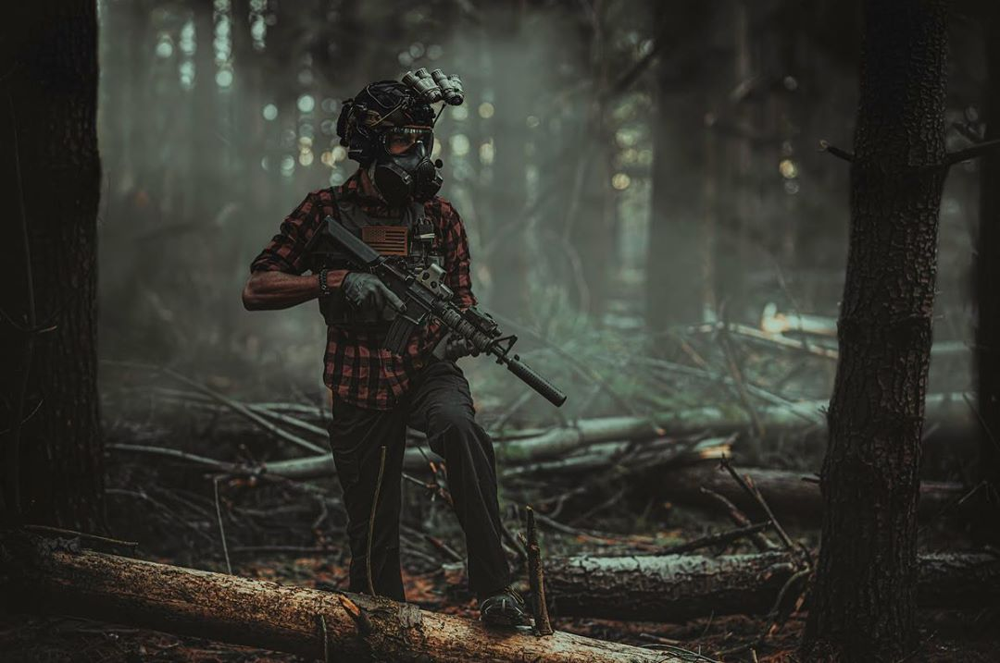
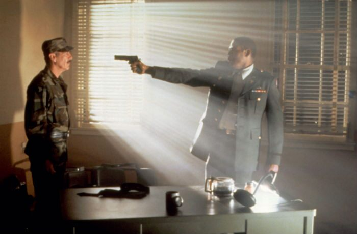
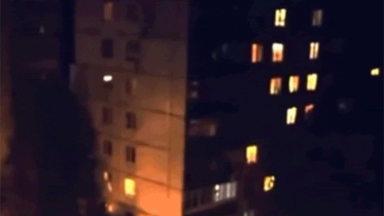

(Source: [arcipello](https://www.deviantart.com/arcipello/art/Water-Patrol-Bionic-Commando-122392510))

Abiogenesis is a roleplaying setting set in near future that has fallen on tough times caused by a cosmic disaster. Incredible phenomena was dispersed across the globe,  ending humankind's understanding of the universe as it spawned otherworldly creatures and reality distorting anomalies.

In the process, society has been locked in a struggle to avoid social collapse, forced to recede from the harassment of these things beyond human comprehension.

([Battlestate Games](https://www.instagram.com/p/CC-0j4nHW7j/))

# Framing
Abiogenesis is a hardboiled tactical adventure set during a recession born by cosmic instability. Characters discover the transformative secrets of the supernormal as they look for opportunity in this new, dangerous world.

([SCP: Overlord](https://www.kickstarter.com/projects/retrodigital/scp-overlord/description?lang=fr))

# Deeper Dive

Abiogenesis is deeply inspired by STALKER and Half Life 1. Campaigns consist of enduring the social instability that the products of this catastrophe bring and exploring this new, darker wilderness for the strange, the uncanny, the cool, and the pants shitting terror that has scarred the country.

For the player, the game is "your daily emergency kit has an AR-15." The cities still hum with life, but they are vulnerable to the new wilderness. Internal refugees, adventurers and bandits are rife.

The tactical adventure can be described by elements of the modern gunfight and the empty battlefield. Cover, concealment are important. Traditional monsters of fantasy are difficult to fit into this type of gameplay, as melee attacks need advantages to outweigh the high lethality of modern weapons.

([Body Snatchers, 1993](https://www.scifi-movies.com/en/stills/0000333/1/body-snatchers-1993/))

## [Noble-dark](https://www.reddit.com/r/40kLore/comments/iqfuu4/meta_grimdark_nobledark_and_the_setting_alignment/)

 The setting's characters should be in a constant friction of what needs to be done in the name of the common good, worrying about what is too tyrannical.

([source](https://www.bbc.com/news/uk-60532586))

## The State in Social Preservation mode
- [ ] rewrite required
Abiogenesis takes place in an setting of an averted apocalypse. All human society narrowly weathered an emergency of unimaginable scale at immense cost. Mammoth pools of resources and knowledge had to be redirected on the spot in response.

As of the moment, the government is saddled with the dual tasks of forming a National Recovery and an arrears of debts and losses it racked, in man, machine, and infrastructure. The end of federal social security, Rationing and conscription form the new normal as the Federal government pulls back from daily life to save for the unfulfilled National Recovery plans.

The landscape of post-de Kuiper America is littered with scrappy enterprises, liquidation startups, impoverished regulators and flimsy answers. It is a new age of the entrepreneur as many of economic champions or core pillars of the economy disappeared almost overnight.

(source: need to find)

## A nearly averted apocalypse
On the precipice of darkness and light; An oppressive, gothic environment is hidden just outside the borders of society

([Alexey Andreyev](https://amp.meduza.io/en/shapito/2017/06/20/concept-art-for-an-abandoned-roadside-picnic-adaptation))

## The Unnatural

([Piotr Jabłoński](https://nicponim.artstation.com/))

## Knowledge Gap
  
Abiogenesis as a setting is meant to have extremely limited knowledge. humanity is not privy to what the exotic matter, the impossible phenomena, or the paradoxical structures precipitated in the de Kuiper event are in any epistemic sense. All humanity knows about de Kuiper's children is knowledge that ranges between contentious hypotheses of tentative value, to pure empirical judgement. 

For the writer, this means that they may use any logic for xenonomena, as long as it fits the themes of Abiogenesis and that humanity maintains this tentative level of understanding.

We are in a new dark age, not one born of an ignorance of burned books and dead scholars, but because some_thing_ else let us see what we thought was a reasonably whole understanding of the universe, is inadequate; One that makes the Ultraviolet Catastrophe look small in comparison.

---
## Authentic, Hardened
When close to home, the world works similarly to our own and the stalkers get see a lot of its darker sides. Abuse, violence and physical injuries should be described just as horrifically as witnessing them in real life would be. Death and murder are serious things, just like in our world.

Even supernatural phenomena are studied from the viewpoint of natural science, not magic or religion. Even if the stalkers lack the scientific understanding of the researchers, their attitudes towards the phenomena and creatures of the Zone are usually very pragmatic.
### You Are Human
As weird as things get in the Zone, the player characters are still the protagonists with their actions and goals. The adventure may take them into the Zone but it is still a story about people, not the Zone. The causes and effects of their adventures are usually found on this side of the border.
## Threats and Disorder
Society exists perilously close to the border of darkness; outside its safety lie an threat to nations and peoples which cannot be underestimated. In extreme cases, failure is not optional.
### [Insecurity](Motivation)
Characters are responsible for making their own living, so the sustenance should weigh heavy on player's minds. See [[#Survival gameplay]]

Normal job opportunities are limited. in return, there's plenty of high risk, high reward jobs.
# Mechanical themes
## Combat patrol
- flavor of a Tarkov Raid
## Survival gameplay
Venturing to make a living or to better ones living
## endemic sustainment costs
constant stress from deficiency needs
## Medium-high lethality
- Character creation can help support gameplay with lots of backup or trickleback
- Lethality can be balanced for immediate consequence (lethal) or deep story (less lethal)
## Party requirements
- the party needs a hideout

# Game engine - Why modify Reflex?

The Reflex system has the tools to fit the nature of a modern gunfight and survival.

- Manage long and short distance combat with range bands and rules for vision at actual firearm ranges

- dice system has competence baked into it - novice skill users are inconsistent while experts often clutch

- Margins of success reward shot placement and broaden the range of success and failure 

- Tick based, original XCOM style Mexican Standoff initiative system for fast paced, highly violent fights: be the first to shoot!

- Operational actions broaden the behavior of gunfights between lulls of shooting

- Vehicle combat rules with damage by hit location

- Survival rules

- Detailed character generation rules (if necessary)
# Inspiration
## STALKER, Roadside picnic
Inspiration comes from the gameplay loop and the protagonist's situation as a hustler exploring for riches, along with the setting's modernity, lethality

Roadside picnic increases this by introducing the concept of cosmic litter seeding the planet with bizarre behavior.
## HP Lovecraft
Shadow over Innsmouth, The Color out of Space
## X-COM
## Half Life
anomalous events and monstrous aliens upend the immersive operations of a top secret government facility on the bleeding edge of scientific discovery.
## Annihilation
Cosmic horror and incomprehensible artifacts that are a significant enough danger to society that they need investigation
## Hellboy
Immersion into a mysterious world of occult detective work hidden behind potemkin normalcy
## X-Files
Immersion into solving the threats of paranormal activity that society is unequipped to handle 
## Still Wakes the Deep

## Other inspiration
- Hunt; Showdown
- Jagged Alliance
- 

# Definitions for success
For abio to be successful, we need to create a tabletop tactical adventure that can be described as stalker meets half life.

More precisely, we are creating a tabletop tactical adventure which takes the concepts of reality altering anomalous phenomena to intellectually immerse the player in the unnerving mysteries and dilemmas of a post disaster society. 

Additional goals:
- should test the feasibility of a tactical adventure
- should introduce the idea of the modern tactical adventure to non-k types
- use the reflex engine
- be interesting and fun for a modest population of tabletop enthusiasts
- contain lots of support to simplify play
- have original phenomena and behavior - this is *not* A setting for classic American paranormal tropes

- not expecting to make money
- not expecting a mainstream audience

---
Another definition for success would be to define the thematic tone through a concept delivered through text, visuals, and sound (like a title sequence).

Since there is no 'best' settled upon theme, we will instead refer to these as the in development examples, not final release

- High or dynamic lethality; hardcore
- Emphasizes rapid and effective decision making
- Emphasis on tempo
- Empty, large battlefields
- Emphasis on concealment
- Emphasis on range over movement
- Restricted information
